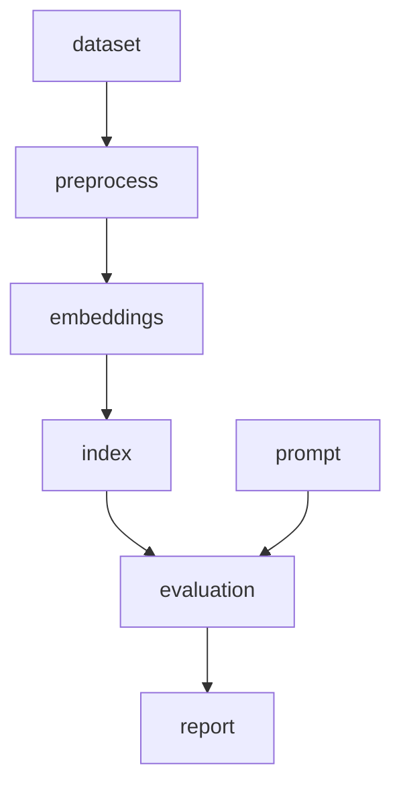

# aimake

**The incremental build system for AI applications.**

[](LICENSE)

`aimake` tracks dependencies between datasets, models, prompts, embeddings, indexes, evaluations, and generated artifacts — rebuilding only what actually changed.

```bash
pip install aimake
```

---

## Why aimake?

Traditional build tools understand `source → object → binary`. AI pipelines are different:



When only a prompt changes, everything upstream should be **skipped**. That is the core value of `aimake`.

| Tool | What it does |
|------|-------------|
| **Make** | Generic file dependencies |
| **DVC** | Data versioning |
| **MLflow** | Experiment tracking |
| **aimake** | Incremental AI pipeline builds with content-addressable caching |

---

## Problem

AI application pipelines have complex, heterogeneous dependencies:

- Datasets change
- Prompts get refined
- Models get swapped
- Embeddings need rebuilding
- Evaluations depend on everything upstream

Re-running the entire pipeline on every change wastes time and money. `aimake` solves this with **content-based fingerprinting** and **dependency-aware incremental builds**.

---

## Installation

```bash
pip install aimake
```

Or with [pipx](https://pipx.pypa.io/) for isolated CLI usage:

```bash
pipx install aimake
```

**Requirements:** Python 3.11+

---

## Quick start

```bash
# Create a new project
aimake init

# Preview what will run
aimake plan

# Build incrementally
aimake build

# Check status
aimake status
```

---

## Example

See [`examples/rag/`](examples/rag/) for a complete RAG pipeline example.

### First build

```bash
cd examples/rag
aimake build
```

All seven artifacts execute: `dataset → preprocess → embeddings → index → prompt → evaluation → report`

### Second build (everything cached)

```bash
aimake build
```

```
0 rebuilt
7 reused
```

### Modify the prompt

```bash
# Edit prompts/system.txt, then:
aimake plan
```

```
dataset        ✓ cached
preprocess     ✓ cached
embeddings     ✓ cached
index          ✓ cached
prompt         → rebuild
evaluation     → rebuild
report         → rebuild
```

```bash
aimake build   # Only 3 artifacts run
```

### Explain why something rebuilt

```bash
aimake explain report
```

---

## How incremental builds work

1. **Read** `aimake.yaml` configuration
2. **Construct** a dependency DAG
3. **Fingerprint** each artifact from its inputs, dependencies, command, parameters, and environment
4. **Compare** fingerprints against stored state
5. **Plan** — skip unchanged, run stale
6. **Execute** only necessary commands (in parallel where possible)
7. **Cache** successful outputs content-addressably
8. **Record** build metadata and metrics

Fingerprints use **SHA-256 content hashes**, not timestamps. Changing a file's timestamp without changing content does **not** invalidate the cache.

---

## Configuration

Create `aimake.yaml` in your project root:

```yaml
project:
  name: my-rag-app
  version: "1.0"

artifacts:

  dataset:
    type: dataset
    source: data/train.jsonl

  processed:
    type: dataset
    depends_on: [dataset]
    command: python src/preprocess.py
    outputs:
      - build/processed/

  embeddings:
    type: embedding
    depends_on: [processed]
    command: python src/embed.py
    outputs:
      - build/embeddings/

  prompt:
    type: prompt
    source: prompts/system.txt

  evaluation:
    type: evaluation
    depends_on: [embeddings, prompt]
    command: python src/evaluate.py
    outputs:
      - build/evaluation/
    metrics:
      file: build/evaluation/results.json

quality_gates:
  accuracy:
    minimum: 0.90
  latency_ms:
    maximum: 500
```

### Input tracking

```yaml
inputs:
  - data/train.jsonl
  - prompts/system.txt
  - data/**          # glob patterns supported
```

### Environment variables

```yaml
environment:
  - MODEL_NAME
  - API_VERSION
```

Environment variable **names** participate in fingerprints. Secret values are redacted in logs and metadata.

---

## CLI reference

| Command | Description |
|---------|-------------|
| `aimake init` | Initialize a new project |
| `aimake build [targets...]` | Incremental build |
| `aimake plan [targets...]` | Preview build plan (dry) |
| `aimake status` | Show artifact status |
| `aimake graph [--format=json\|dot\|ascii]` | Display dependency DAG |
| `aimake clean [--all]` | Remove build outputs / cache |
| `aimake history` | Show build history |
| `aimake inspect <artifact>` | Detailed artifact info |
| `aimake explain <target>` | Why is this target stale? |
| `aimake doctor` | Project health checks |
| `aimake eval --check` | Quality gate validation |
| `aimake logs <build-id>` | View build logs |
| `aimake build --jobs N` | Parallel execution |
| `aimake build --force` | Force rebuild |
| `aimake build --dry-run` | Preview without executing |
| `aimake build -v` | Verbose output |
| `aimake build --debug` | Debug fingerprinting |

---

## Artifact types

| Type | Description |
|------|-------------|
| `dataset` | Training/evaluation data |
| `model` | Model weights or configuration |
| `prompt` | Prompt templates |
| `embedding` | Vector embeddings |
| `vector_index` | Search indexes |
| `evaluation` | Evaluation runs and metrics |
| `report` | Generated reports |
| `generic` | Any other artifact |

Each artifact supports: `name`, `type`, `depends_on`, `inputs`, `outputs`, `command`, `source`, `environment`, `parameters`, `metadata`.

---

## Caching

Cache is stored locally in `.aimake/`:

```
.aimake/
├── state.db          # SQLite metadata
├── cache/
│   └── <hash>/       # Content-addressable outputs
└── logs/
    └── build-001.log
```

Cache writes are **atomic** — a crash mid-build cannot corrupt entries.

The lock file `aimake.lock` records artifact fingerprints for logical reproducibility.

> **Note:** `aimake` provides *logical* reproducibility (same inputs → same pipeline decisions). Bit-for-bit reproducibility across environments is not guaranteed due to OS, Python version, and floating-point differences.

---

## Evaluation

After evaluation artifacts run, metrics are parsed from JSON:

```json
{
  "accuracy": 0.912,
  "f1": 0.887,
  "latency_ms": 412,
  "cost_usd": 0.42
}
```

Quality gates in CI:

```bash
aimake build
aimake eval --check
```

```
QUALITY GATE FAILED

accuracy:
  0.84 < required 0.90
```

---

## CI

```yaml
name: AI Build

on: [push, pull_request]

jobs:
  aimake:
    runs-on: ubuntu-latest
    steps:
      - uses: actions/checkout@v4
      - uses: actions/setup-python@v5
        with:
          python-version: "3.11"
      - run: pip install aimake
      - run: aimake build
      - run: aimake eval --check
```

See [`.github/workflows/ci.yml`](.github/workflows/ci.yml) for the full workflow.

---

## Architecture

```
aimake/
├── cli.py              # Typer CLI
├── project.py          # Python API (Project.load, .build, .plan)
├── config/             # YAML schema, loader, validation
├── graph/              # DAG, topological sort, planner
├── hashing/            # SHA-256 fingerprints
├── cache/              # SQLite + filesystem cache
├── execution/          # Subprocess runner, parallel scheduler
├── artifacts/          # Type-specific artifact handlers
├── metrics/            # Metrics parsing, quality gates
├── git/                # Git metadata integration
├── state/              # SQLite state database
└── ui/                 # Rich terminal output
```

### Python API

```python
from aimake import Project

project = Project.load("aimake.yaml")
plan = project.plan()
result = project.build()
explanation = project.explain("evaluation")
project.close()
```

---

## Development

```bash
git clone https://github.com/aimake/aimake
cd aimake
pip install -e ".[dev]"
pytest tests/ -v
```

---

## Security

`aimake.yaml` contains **executable commands** that run on your machine. Review configuration before building, especially from untrusted sources. Secret environment variables are redacted from logs. No remote code execution or automatic configuration loading occurs.

---

## Roadmap

- **Phase 2:** Remote cache, S3, artifact registry, diff tools, web dashboard
- **Phase 3:** Distributed builds, GPU-aware scheduling, experiment comparison
- **Phase 4:** Plugin ecosystem (Hugging Face, MLflow, W&B, DVC, Docker)

The plugin interface is designed but integrations are not yet implemented. Use `aimake plugins` to see planned integrations.

---

## Contributing

Contributions are welcome! Please open an issue or pull request.

---

## License

Apache License 2.0 — see [LICENSE](LICENSE).
